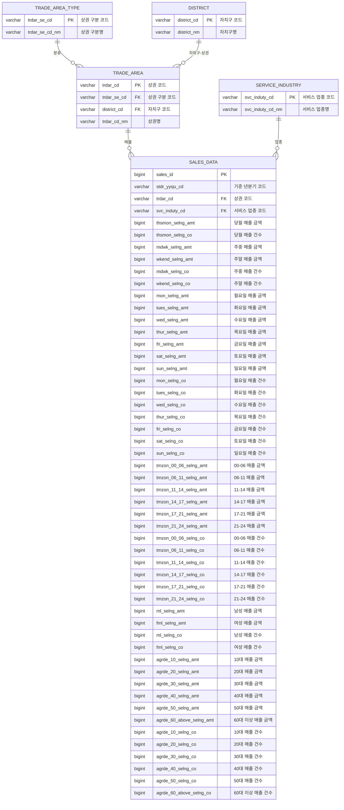

# Architecture

서울 상권 데이터를 탐색·상세 분석·비교하는 풀스택 애플리케이션의 구조와 주요 파일 책임을 정리한 문서입니다.

## 1. 전체 구조

```text
analysis-team/
├── frontend/                 # React 화면, 상태, API 호출
│   └── src/
│       ├── app/              # 앱 조립과 라우팅
│       ├── pages/            # URL 단위 화면
│       └── shared/           # 여러 화면이 함께 쓰는 API·타입·UI·상태
├── backend/                  # FastAPI API 서버
│   └── app/
│       ├── core/             # 설정, DB, 공통 예외
│       └── domain/           # 업무 도메인별 API·서비스·저장소·스키마
├── docs/                     # 지표 정의와 프로젝트 계획
├── agency-agents/            # 제품 런타임과 분리된 에이전트 문서/라이브러리
├── README.md                 # 프로젝트 소개 및 실행 안내
└── ARCHITECTURE.md           # 이 문서
```

## 2. 데이터 요청 흐름

```text
사용자
  ↓
frontend/src/pages/*Page.tsx
  ↓ React Query + frontend/src/shared/api/client.ts
  ├─ 정상: backend API 호출
  └─ 실패/미실행: frontend/src/shared/api/mockData.ts 사용
        ↓
backend/app/main.py
  ↓ domain router.py
  ↓ domain service.py
  ├─ repository.py → DB 조회
  └─ 계산/조합 → schemas.py 응답 검증
```

프론트엔드는 백엔드가 실행되지 않아도 동일한 응답 형태의 mock 데이터로 동작합니다. 따라서 `client.ts`, `mockData.ts`, 백엔드 `schemas.py`의 필드 이름과 중첩 구조는 항상 함께 변경해야 합니다.

## 3. Frontend 파일별 책임

### 앱 조립

| 경로                                | 책임                                                                               |
| ----------------------------------- | ---------------------------------------------------------------------------------- |
| `frontend/src/main.tsx`             | React 애플리케이션의 브라우저 진입점. `App`을 DOM에 마운트합니다.                  |
| `frontend/src/App.tsx`              | 앱의 최상위 컴포넌트. 현재 라우터를 렌더링합니다.                                  |
| `frontend/src/app/router/index.tsx` | React Router 경로, 공통 `Header`/`Footer`, React Query `QueryClient`를 조립합니다. |
| `frontend/index.html`               | Vite가 사용하는 HTML 진입 문서입니다.                                              |
| `frontend/vite.config.ts`           | Vite 개발 서버와 빌드 설정입니다.                                                  |
| `frontend/src/index.css`            | 전역 CSS와 디자인 시스템의 기본 스타일을 정의합니다.                               |

### 화면

| 경로                                                 | 책임                                                                               |
| ---------------------------------------------------- | ---------------------------------------------------------------------------------- |
| `frontend/src/pages/explore/ExplorePage.tsx`         | 업종·지역·분기 필터, 추천 상권 목록, 비교 선택, 상세 화면 이동을 담당합니다.       |
| `frontend/src/pages/district/DistrictDetailPage.tsx` | 상권 상세 KPI, 순위, 소비 패턴, 경쟁 정보를 조회하고 시각화 컴포넌트에 전달합니다. |
| `frontend/src/pages/compare/ComparePage.tsx`         | 선택한 최대 3개 상권의 비교 데이터를 조회하고 비교 매트릭스를 표시합니다.          |

페이지는 화면 상태와 데이터 조회를 조정하는 곳입니다. 점수 계산, API URL 조립, 재사용 가능한 시각화 구현은 페이지에 넣지 않습니다.

### 공통 계층

| 경로                                  | 책임                                                                                      |
| ------------------------------------- | ----------------------------------------------------------------------------------------- |
| `frontend/src/shared/api/client.ts`   | 백엔드 API 호출을 한곳에 모읍니다. 요청 실패·백엔드 미실행 시 mock fallback을 적용합니다. |
| `frontend/src/shared/api/mockData.ts` | 개발·데모용 결정적 mock 데이터와 mock 조회 함수를 제공합니다.                             |
| `frontend/src/shared/types/index.ts`  | 프론트엔드가 사용하는 도메인·응답 TypeScript 타입의 기준입니다.                           |
| `frontend/src/shared/lib/store.ts`    | Zustand로 비교함의 선택 상권 목록과 추가·삭제·토글 규칙을 관리합니다.                     |
| `frontend/src/shared/ui/Header.tsx`   | 전역 헤더, 네비게이션, 비교함 개수, 산출 로직 모달을 표시합니다.                          |
| `frontend/src/shared/ui/Charts.tsx`   | 순위·시간대·연령/성별·요일 데이터의 공통 시각화 컴포넌트입니다.                           |
| `frontend/src/shared/ui/Signals.tsx`  | 성장·거래·경쟁 시그널과 점수 배지를 표시합니다.                                           |

## 4. Backend 파일별 책임

### 애플리케이션 공통 계층

| 경로                             | 책임                                                                               |
| -------------------------------- | ---------------------------------------------------------------------------------- |
| `backend/app/main.py`            | FastAPI 앱 생성, CORS, 예외 핸들러, 도메인 라우터 등록, health check를 담당합니다. |
| `backend/app/core/config.py`     | 환경변수와 기본 설정을 Pydantic Settings로 읽습니다.                               |
| `backend/app/core/database.py`   | SQLAlchemy 비동기 엔진·세션·선언형 Base·DB 의존성을 제공합니다.                    |
| `backend/app/core/exceptions.py` | 공통 애플리케이션 예외와 일관된 오류 응답 형식을 정의합니다.                       |
| `backend/app/seed.py`            | 개발용 DB 초기 데이터를 생성합니다.                                                |

### 도메인 계층

각 도메인은 대체로 다음 규칙을 따릅니다.

```text
router.py    HTTP 입력/출력과 의존성 주입
service.py   업무 규칙, 계산, 여러 저장소 결과 조합
repository.py DB 조회 추상화
models.py    SQLAlchemy 영속 모델
schemas.py   API 요청/응답 계약
```

| 도메인       | 주요 파일       | 책임                                              |
| ------------ | --------------- | ------------------------------------------------- |
| `trade_area` | `router.py`     | 상권 목록·기본 정보 API 엔드포인트                |
|              | `service.py`    | 상권 조회 업무 흐름                               |
|              | `repository.py` | 상권 데이터 DB 조회                               |
|              | `models.py`     | 상권 테이블 모델                                  |
|              | `schemas.py`    | 상권 API 응답 모델                                |
| `industry`   | `router.py`     | 업종 목록 API 엔드포인트                          |
|              | `service.py`    | 업종 조회 업무 흐름                               |
|              | `repository.py` | 업종 데이터 DB 조회                               |
|              | `models.py`     | 업종 테이블 모델                                  |
|              | `schemas.py`    | 업종 API 응답 모델                                |
| `sales`      | `router.py`     | 매출·거래·패턴 관련 API 엔드포인트                |
|              | `service.py`    | 매출 데이터 조회와 표현용 조합                    |
|              | `repository.py` | 매출 데이터 DB 조회                               |
|              | `models.py`     | 매출 관련 테이블 모델                             |
|              | `schemas.py`    | 매출 API 응답 모델                                |
| `analytics`  | `router.py`     | 추천·상세 개요·패턴·경쟁·비교 API 엔드포인트      |
|              | `service.py`    | 탐색 점수 계산, 추천, 상세 분석, 비교 데이터 조합 |
|              | `schemas.py`    | 분석 API 응답 계약                                |

`analytics`는 `trade_area`와 `sales` 저장소를 조합하는 상위 업무 도메인입니다. 반대로 repository가 점수를 계산하거나 router가 DB를 직접 조회하지 않도록 유지합니다.

## 5. 데이터 모델 및 ERD

백엔드의 영속 데이터는 상권, 자치구, 상권 유형, 서비스 업종, 매출 데이터를 중심으로 구성합니다.
기준 정보는 별도 테이블로 분리하고, `SALES_DATA`가 상권과 서비스 업종을 참조하는 구조입니다.



### 테이블별 역할

| 테이블                | 역할                                        |
| ------------------ | ----------------------------------------- |
| `TRADE_AREA_TYPE`  | 골목상권, 발달상권 등 상권의 구분 정보를 관리하는 기준 테이블입니다.   |
| `DISTRICT`         | 서울시 자치구 코드와 자치구명을 관리하는 기준 테이블입니다.         |
| `TRADE_AREA`       | 개별 상권의 코드와 이름을 관리하며 상권 유형과 자치구를 참조합니다.    |
| `SERVICE_INDUSTRY` | 분석 대상이 되는 서비스 업종 코드와 업종명을 관리하는 기준 테이블입니다. |
| `SALES_DATA`       | 상권·업종·분기 단위의 매출 데이터를 저장하는 핵심 사실 테이블입니다.   |

### 주요 관계

* 하나의 `TRADE_AREA_TYPE`에는 여러 `TRADE_AREA`가 속할 수 있습니다.
* 하나의 `DISTRICT`에는 여러 `TRADE_AREA`가 속할 수 있습니다.
* 하나의 `TRADE_AREA`에는 여러 분기·업종의 `SALES_DATA`가 연결됩니다.
* 하나의 `SERVICE_INDUSTRY`에는 여러 상권·분기의 `SALES_DATA`가 연결됩니다.
* `SALES_DATA`는 `trdar_cd`와 `svc_induty_cd`를 통해 각각 상권과 서비스 업종을 참조합니다.

### 매출 데이터 구성

`SALES_DATA`는 단순 총매출뿐 아니라 상세 분석 화면에서 바로 활용할 수 있도록 다음 기준의 집계값을 함께 저장합니다.

* **전체 매출**: 당월 매출 금액과 매출 건수
* **주중·주말**: 주중/주말별 매출 금액과 건수
* **요일별**: 월요일부터 일요일까지의 매출 금액과 건수
* **시간대별**: `00-06`, `06-11`, `11-14`, `14-17`, `17-21`, `21-24` 구간별 매출 금액과 건수
* **성별**: 남성·여성별 매출 금액과 건수
* **연령대별**: 10대, 20대, 30대, 40대, 50대, 60대 이상 매출 금액과 건수

이 구조를 통해 상세 화면의 소비 패턴과 상권 간 비교에 필요한 데이터를 별도의 추가 집계 테이블 없이 조회할 수 있습니다.

`analytics` 도메인은 별도의 영속 테이블을 소유하지 않습니다. `TRADE_AREA`, `SERVICE_INDUSTRY`, `SALES_DATA` 등의 데이터를 repository를 통해 조회한 뒤 서비스 계층에서 성장성, 거래량, 경쟁도 등의 지표를 계산·조합하여 API 응답을 생성합니다.


## 6. 주요 API와 화면 매핑

| 화면 | 프론트 API 함수                | 백엔드 엔드포인트                            |
| ---- | ------------------------------ | -------------------------------------------- |
| 탐색 | `api.getIndustries()`          | `GET /api/v1/industries`                     |
| 탐색 | `api.getRecommendations()`     | `GET /api/v1/analytics/recommendations`      |
| 상세 | `api.getDistrictOverview()`    | `GET /api/v1/trade-areas/{code}/overview`    |
| 상세 | `api.getDistrictPatterns()`    | `GET /api/v1/trade-areas/{code}/patterns`    |
| 상세 | `api.getDistrictCompetition()` | `GET /api/v1/trade-areas/{code}/competition` |
| 비교 | `api.getCompareData()`         | `GET /api/v1/compare`                        |

## 7. 핵심 업무 규칙

탐색 점수는 다음 가중치를 사용합니다.

```text
점수 = 매출 성장성 × 0.40
     + 거래량 × 0.35
     + 경쟁 완화도 × 0.25
```

관련 기준은 `backend/app/domain/analytics/service.py`, 프론트 mock 반영값은 `frontend/src/shared/api/mockData.ts`, 공식 지표 정의는 `docs/상권 분석 지표 산출 정의서.md`에 있습니다.

## 8. 변경 시 지켜야 할 의존성 규칙

1. API 응답 필드를 바꾸면 백엔드 `schemas.py`, 서비스 반환값, 프론트 `types/index.ts`, `mockData.ts`, 사용 페이지를 함께 확인합니다.
2. 점수 산식을 바꾸면 실제 서비스 계산과 mock 점수, 문서의 가중치를 함께 바꿉니다.
3. 페이지는 `shared/api/client.ts`를 사용하고 `fetch`를 직접 호출하지 않습니다.
4. DB 접근은 repository를 통해서만 합니다. router와 UI에서 SQLAlchemy 모델을 직접 사용하지 않습니다.
5. 공통 UI는 `shared/ui`, 특정 화면에서만 쓰는 UI는 해당 page 폴더에 둡니다.
6. 경쟁 위험은 디자인 규칙상 빨간색을 사용하고, 일반 강조에는 네온 라임을 사용합니다.

## 9. 현재 구조에서 다음에 개선하기 좋은 지점

- 백엔드 도메인 폴더에 `__init__.py`를 명시해 패키지 경계를 더 분명하게 만들기
- 프론트 페이지에 섞인 API 쿼리와 화면 표시 로직을 `features/` 또는 페이지별 hooks로 분리하기
- 백엔드와 프론트의 응답 계약을 OpenAPI 생성 타입 또는 공유 스키마로 자동 동기화하기
- `analytics/service.py`의 하드코딩 후보 데이터를 repository/분석 파이프라인으로 단계적으로 이동하기
- CORS의 `allow_origins=["*"]`를 운영 환경 설정값으로 제한하기
